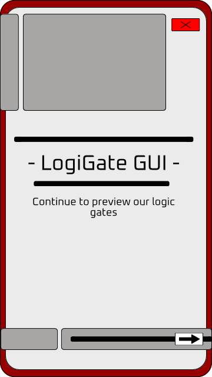
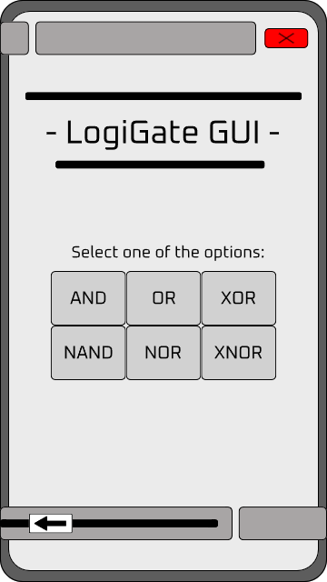
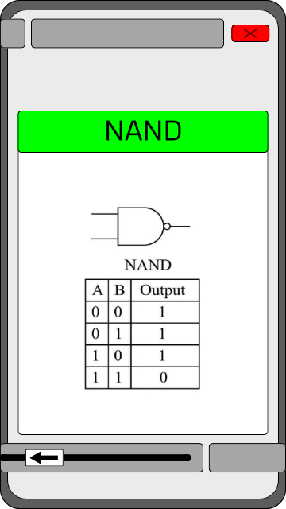

# logiGate_gui
LogiGate GUI is a project intended to display logic gates using a gui, so, the user can navigate through the GUI selecting which gate diagram and truth table wants to see. This is intended to be a quick project to practice and refresh C++ skills. The GUI concept and design was developed by my self using graphics design editing tools.

## Interface design:
- [Welcome window](assets/welcome_page.png)

    

- [Gate selecting window](assets/gate_select_page.png)

    

- [NAND window](assets/nand_gate_show_page.png)

    